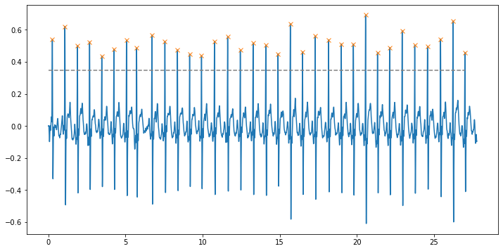

  
# ECG Analysis Assignment  
## User Manual  
#### The script will analyze the ECG signal from a CSV file that will have lines with `time, voltage` The following data will be calculated and saved in json files
+ #### `duration`: time duration of the ECG strip
+ #### `voltage_extremes`: tuple in the form (min, max) where min and max are the minimum and maximum lead voltages found in the data file.
+ #### `num_beats`: number of detected beats in the strip, as a numeric variable type.
+ #### `mean_hr_bpm`: estimated average heart rate over the length of the strip
+ #### `beats`: list of times when a beat occurred  

### Instructions
+ To start the program run `python ecg_analysis.py` on the command line  
+ Read the instructions and view all the files in current path
+ Enter the file name you want to analysis
+ Program will show you all the metrics above
+ If you want to visualize the ECG signal and the peaks, follow instructions and enter y
+ You can find the ECG analyzed in as a .json file in current folder

### What is regarded as a peak?
The local maximum values are regarded as peak, I called the scipy.signal.find_peaks
[The details of this package -->](https://docs.scipy.org/doc/scipy/reference/generated/scipy.signal.find_peaks.html)  

### How did I calculate the BPM?  
`mean_hr_bmp = num_beats/duration * 60`    

***Original***
  

***Envelope of ECG Signal***
  

***Comparison***
  

  
***After denoising with peaks detected***
  
  *v1.0.0*  
  

